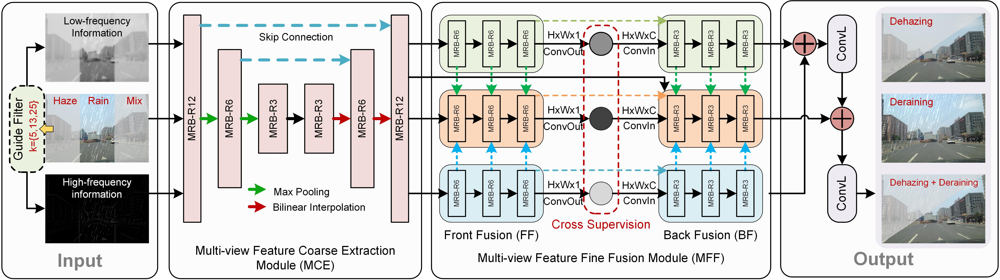
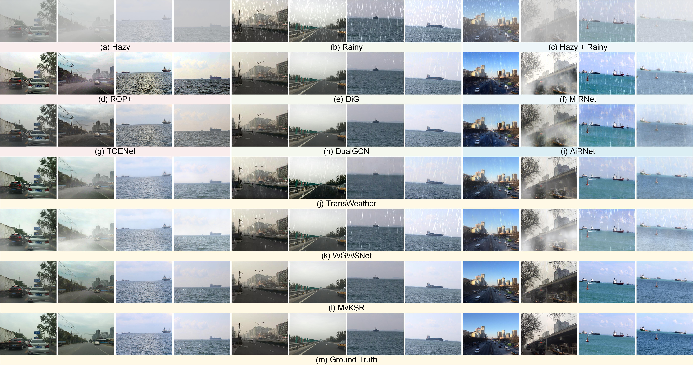
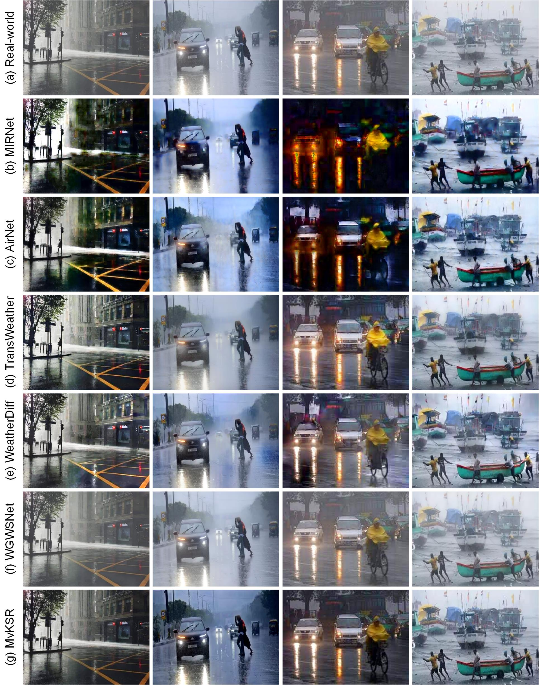

# <p align=center>  MvKSR: Multi-view Knowledge-guided Scene Recovery for Hazy and Rainy Degradation</p>

<div align="center">


</div>

---
>**MvKSR: Multi-view Knowledge-guided Scene Recovery for Hazy and Rainy Degradation**<br>  [Dong Yang](https://www.yangdong.info/), Wenyu Xu, [Yuan Gao](https://scholar.google.com.hk/citations?user=4JpRnU4AAAAJ&hl=zh-CN), [Yuxu Lu<sup>*</sup>](https://scholar.google.com.hk/citations?user=XXge2_0AAAAJ&hl=zh-CN), Jingming Zhang, [Yu Guo](https://scholar.google.com/citations?user=klYz-acAAAAJ&hl=zh-CN)  (* indicates corresponding author) <br> 
>Under Review

> **Abstract:** *High-quality imaging is essential for effective safety supervision and intelligent deployment in vision-based measurement systems (VMS). It allows for accurate and comprehensive monitoring of operations, enabling the timely detection of potential hazards and efficient management. However, adverse weather conditions, such as atmospheric haziness and precipitation, can greatly affect the quality of imaging. The degradation is evident in the form of image blur and reduced contrast, increasing the likelihood of incorrect assessments and interpretations in VMS. To address the challenge of restoring degraded images in hazy and rainy conditions, this paper proposes a novel multi-view knowledge-guided scene recovery network (termed MvKSR). Specifically, guided filtering is performed on the degraded image to separate high/low-frequency components. Subsequently, an Encoder-Decoder-based multi-view feature coarse extraction module is used to coarsely extract features from different views of the degraded image. The multi-view feature fine fusion module will learn and infer the restoration of degraded images through cross supervision under different views. Extensive experimental results demonstrate that MvKSR outperforms other state-of-the-art methods in terms of efficiency and stability for restoring degraded scenarios, and can better serve the needs of advanced vision tasks in VMS.*
<hr />

## Requirement

- Python 3.7
- Pytorch 1.12.0


## Network Architecture


## Test
The pre-trained model will be provided after the paper is accpeted.

## Visual Results on Synthetic Images


## Visual Results on Real-world Images


## Citation

```
Continue Update
